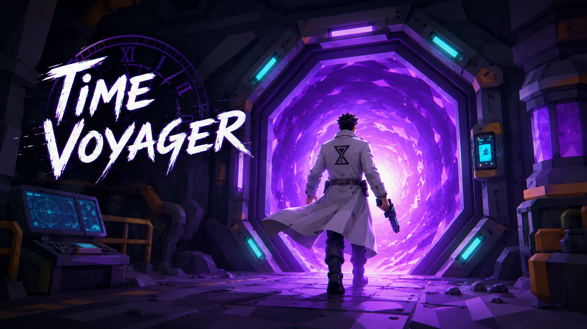

  

# Time Voyager

**Time Voyager** is a first-person adventure game about Peter, a character pulled through unstable portals into worlds that should never be connected. Every portal throws him into a new place with its own danger, rules, allies, and escape condition.

From a haunted mansion to a dragon dungeon, a futuristic city, a fantasy kingdom, a samurai village, and a mysterious lab, Peter must survive each world long enough to open the next portal. The game mixes exploration, quests, item collection, combat, NPC dialogue, locked paths, and world-to-world progression.

**Download-link:** [Here](https://zahraahubail.itch.io/time-voyager)

## 🎮 Project Snapshot

| Detail | Description |
| --- | --- |
| 🛠️ Engine | Unity |
| 🕹️ Genre | First-person adventure |
| 🧍 Player Character | Peter |
| 🔁 Main Loop | Explore, interact, collect, fight, complete quests, unlock portals |
| 🌀 Core Theme | A journey through disconnected worlds linked by portals |
| 👥 Team Size | 6 members |

## 👥 Team Responsibilities

| Order | Level | Responsible | Role in the Journey |
| --- | --- | --- | --- |
| 1 | 🧪 Lab Level | [Maha Hafeez](https://github.com/mahaH26) | Technical level with computers, power systems, satellite objectives, keycards, weapons, and portal activation. |
| 2 | ⛩️ Samurai Level | [Fatima Alaiwi](https://github.com/Fatima-Alaiwi) | Village objective level with fruit collection, gas bottles, braziers, enemy encounters, bamboo barriers, and the gong portal. |
| 3 | 🏚️ Horror Mansion | [Raghad Alesakfi](https://github.com/RaghadAlesakfi) | Escape level that introduces exploration, keys, locked doors, voice lines, and the mansion portal. |
| 4 | 🏰 Kingdom | [Norain Almajed](https://github.com/NorainAlmajed) | Fantasy NPC quest chain with the Fairy, Merchant, Mage, treasure collection, and rewards. |
| 5 | 🐉 Dungeon | [Zahraa Hubail](https://github.com/zahraa-hubail) | Quest-and-combat level where Peter solves door requirements, meets the Wise Man, and defeats the dragon. |
| 6 | 🤖 Future / Sci-Fi City | [Manaf Hujairi](https://github.com/Manaf-10) | Mission-based level with InfoBot guidance, elevators, power-cell tasks, truck driving, robots, and cutscene. |

## 🌀 Game Progression

The game is built around portal-based progression. Each level acts like a chapter in Peter's journey:

1. Peter enters a new world.
2. The player explores the environment and discovers the objective.
3. NPCs, locked doors, enemies, or collectible items create the challenge.
4. Completing the main quest unlocks a portal or transition.
5. Peter moves into the next world.

## 🌍 Levels

All level flows are grouped here in the same order as the responsibility table.

### 🧪 Level 1: Lab Level

**Responsible:** [Maha Hafeez](https://github.com/mahaH26)

The lab level is a technical chapter built around machines, panels, power systems, and portal activation. Peter interacts with computers, aligns satellite systems, restores power, collects keycards and power cells, obtains a gun, and unlocks the portal after the required objectives are complete.

**Flow**

1. Find Keycard to enter Portal Room.
2. Use computers and control panels.
3. Complete satellite and power Cell objectives.
4. Pick up the gun.
5. Activate the portal when all conditions are met.

### ⛩️ Level 2: Samurai Level

**Responsible:** [Fatima Alaiwi](https://github.com/Fatima-Alaiwi)

The samurai level focuses on village objectives, enemy encounters, and ritual-style progression. Peter helps the Farmer, collects fruit and gas bottles, lights braziers, clears enemies, breaks through bamboo obstacles, and activates the final portal by striking the gong.

**Flow**

1. Enter the samurai village.
2. Help the Farmer by collecting fruit baskets.
3. Collect gas bottles.
4. Light the braziers at the gate.
5. Clear enemy encounters and bamboo barriers.
6. Use the activated portal.

### 🏚️ Level 3: Horror Mansion

**Responsible:** [Raghad Alesakfi](https://github.com/RaghadAlesakfi)

Peter wakes inside a haunted mansion with locked rooms, strange clues, and no safe exit. The player must search the mansion, interact with doors and objects, collect the required items, and reach the hidden portal. This level introduces the player to exploration, interaction prompts, locked paths, keys, voice lines, and the first major scene transition.

**Flow**

1. Explore the mansion.
2. Find and use key items.
3. Unlock the path to the portal.
4. Trigger the portal sequence.
5. Escape into the Kingdom.

### 🏰 Level 4: Kingdom

**Responsible:** [Norain Almajed](https://github.com/NorainAlmajed)

The kingdom level becomes a fantasy quest chain built around character interactions. Peter follows guidance from the Fairy, Merchant, and Mage. The player collects treasures, receives rewards, and completes the Mage objective to push the story forward.

**Flow**

1. Enter the fantasy kingdom.
2. Talk to the Fairy and receive guidance.
3. Follow the quest chain to the Merchant.
4. Collect the treasure items required by the Mage.
5. Hand in the treasure.
6. Complete the Mage objective and prepare for the next step.

### 🐉 Level 5: Dungeon

**Responsible:** [Zahraa Hubail](https://github.com/zahraa-hubail)

After escaping the mansion, Peter lands in a dungeon filled with locked gates, quest paths, and a dragon guarding the way forward. The player must collect items, solve door requirements, complete NPC objectives, and prepare for the final dragon encounter. The portal only opens once the dragon challenge is complete.

**Flow**

1. Enter the dungeon from the mansion portal.
2. Search for keys and useful items.
3. Complete dungeon quests and Wise Man objectives.
4. Unlock deeper areas through quest-based doors.
5. Defeat the dragon.
6. Use the unlocked portal to continue.

### 🤖 Level 6: Future / Sci-Fi City

**Responsible:** [Manaf Hujairi](https://github.com/Manaf-10)

The future level changes the pace into a mission-based sci-fi city. Peter meets InfoBot, follows guided objectives, investigates a building, handles power-cell tasks, uses elevators, drives a sci-fi truck, and fights robots. This chapter adds mission markers, vehicle gameplay, cutscenes, and ranged robot combat.

**Flow**

1. Meet InfoBot and receive the first mission.
2. Investigate the target building.
3. Load the power cell into the truck.
4. Drive the truck to the delivery point.
5. Trigger the delivery cutscene.
6. Fight or clear robot threats.
7. Continue the quest chain toward the next transition.

## ⚙️ Core Systems

### 📜 Quest System

Quests guide the player through each world. They track objectives, show progress, and decide when important gates, rewards, or portals should unlock.

### 🤝 Interaction System

The player can look at objects and interact with them using prompts. This system is used for doors, NPCs, portals, pickups, computers, panels, and story objects.

### 🎒 Inventory System

The inventory stores collected items such as keys, treasure, power cells, gas bottles, fruit, and other quest items. These items help unlock doors, complete objectives, or progress dialogue.

### ⚔️ Combat and Enemies

Combat includes melee enemies, ranged enemies, robot attacks, enemy spawning, weapon use, ammo, reloading, hit effects, and enemy defeat tracking.

### ❤️ Health System

The player and enemies have health. Damage lowers health, healing restores it, and player death reloads the current level after a short delay.

### 🚪 Doors, Locks, and Progress Gates

Doors and gates control progression. Some require keys, some require completed quests, and others require multiple steps before they open.

### 🌀 Portal and Scene Transitions

Portals connect the worlds. Some portals are available after discovery, while others only activate when the player finishes the required level objective.

### 🗣️ NPC, Dialogue, and Voice Lines

NPCs help guide the player through the story. They give objectives, play voice lines, react to completed quests, and move Peter toward the next goal.

### 🚚 Vehicle, Cutscene, and Mission Guidance

The future level includes truck driving, guided mission markers, scripted delivery moments, traffic movement, and cinematic quest transitions.

### 🖥️ UI, Pause, and Settings

The game includes interaction prompts, quest display, health display, ammo display, pause menu, settings, instructions, credits, and main menu navigation.

## 🎮 Controls

| Action | Input |
| --- | --- |
| Move | WASD |
| Look | Mouse |
| Interact | E |
| Mage treasure hand-in | Q |
| Shoot | Left Mouse Click |
| Reload | R |
| Pause | ESC |

##
